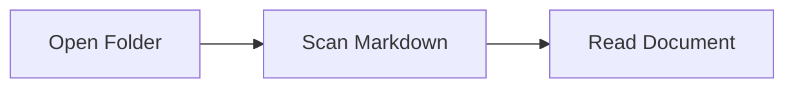

# Sample Docs

This fixture folder verifies local folder navigation.

## Links

- [Guide](docs/guide.md#install)
- [API](docs/api.md)

## Table

| Feature | Status |
| --- | --- |
| File tree | Ready |
| Outline | Ready |

## Tasks

- [x] Render Markdown
- [ ] Add more documents

## Code

```ts
export const message = 'hello markdown';
```

## Diagram



## Formula

Inline math: $E = mc^2$.
